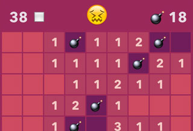

mineswifter
===========

A Swift implementation of Minesweeper.

- *MineswifterGame* contains the game logic, in functional-ish style (algebraic data types, abuse of functions).
- *MineswifterScene* contains the view logic&mdash;it's a normal SpriteKit scene.
- No drawn sprites&mdash;only emoji.

This should run on the simulator or on any device running iOS 7.0+.

To play&mdash;tap a square quickly to reveal it, or hold longer to flag it. Hit a bomb, and you die. Uncover all the bomb-less squares, and you win! Tap the face to start a new game.